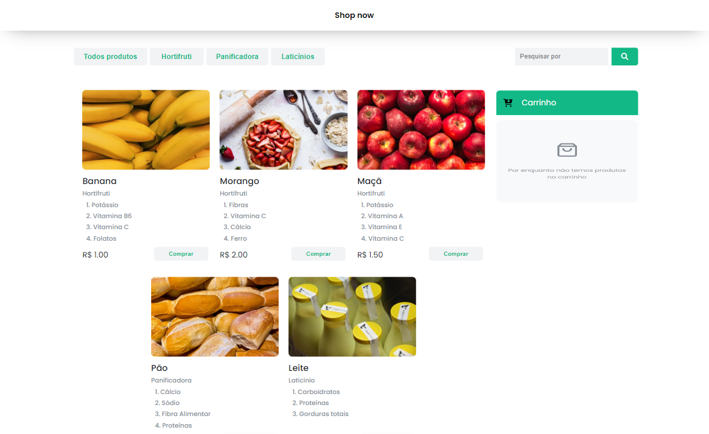
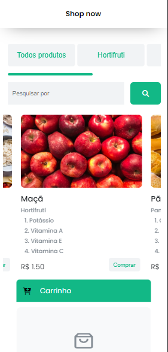

# Shop Now

Este é um projeto front-end de um e-commerce de um mercado, simples mas funcional.

## Visite o site!!

https://edmar-cardoso.github.io/e-commerce-mercado/

## Layout

### Desktop

### Mobile

##### Tecnologias usadas:

- HTML
- CSS
- JavaScript

##### Créditos:

- Layout e Figma disponibilizados por Kenzy Academy Brasil
- Desenvolvido por [Edmar-Cardoso](https://github.com/Edmar-Cardoso)
